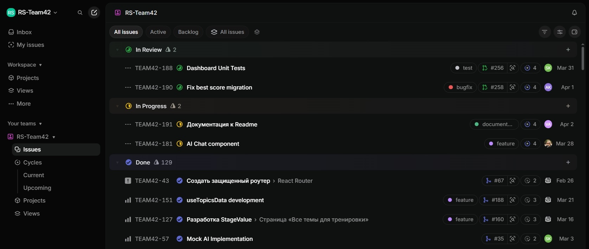

# **:atom_symbol:** RS Tandem

## :open_book: ​О проекте

**RS Tandem** — это интерактивный тренажёр для подготовки к техническим собеседованиям в RS School, где пользователь отвечает на вопросы, а искусственный интеллект оценивает ответы и даёт развёрнутый фидбек. AI выступает в роли «судьи», анализирует ответ по критериям (рубрикам) и объясняет ошибки понятным языком. База из 33 тем и 157 заданий, покрывающих фронтенд от основ до уровня middle+ — многие вопросы выходят за рамки учебной программы, чтобы подготовить к реальным собеседованиям.

- **OAuth-авторизация** — вход через GitHub или Google одним кликом.
- **Theory tasks** — пользователь пишет текстовый ответ на вопрос, AI оценивает его по структурированной рубрике и показывает покрытые и непокрытые критерии.
- **AI-чат помощник** — поскольку некоторые задания выходят за рамки курса, разработан встроенный чат для подсказок и разбора сложных тем. Построен на RAG-архитектуре: учитывает контекст правильных ответов из базы, помогает разобраться в теме без прямой выдачи ответа.
- **История сабмитов** — все успешные попытки сохраняются, можно отслеживать динамику.

:link: Реализовано на основании документации [AI Judge: Supabase + WebContainer](https://github.com/rolling-scopes-school/tasks/blob/master/stage2/tasks/rs-tandem/examples/03-ai-prep-app/variant-b/ai-judge.md) к заданию RS School.

## Deployment

:globe_with_meridians: ​**Deploy Link** https://rs-tandem.netlify.app/

:link: **Linear Project** - https://linear.app/rs-team42/team/TEAM42/all



## :busts_in_silhouette: ​Наша команда и дневники

| Разработчики | Github                                          | Дневники разработки                                                                  |
| ------------ | ----------------------------------------------- | ------------------------------------------------------------------------------------ |
| Андрей       | [kanoplich](https://github.com/kanoplich)       | :file_folder: [дневники + self-assessment ](./development-notes/github-kanoplich)    |
| Артур        | [artkoro94](https://github.com/artkoro94)       | :file_folder: ​[дневники + self-assessment](./development-notes/github-artkoro94)    |
| Вадим        | [vadim-troian](https://github.com/vadim-troian) | :file_folder: ​[дневники + self-assessment](./development-notes/github-vadim-troian) |
| Валерий      | [rockabil](https://github.com/rockabil)         | :file_folder: ​[дневники + self-assessment](./development-notes/github-rockabil)     |
| Сева         | [sevasmith](https://github.com/sevasmith)       | :file_folder: ​[дневники + self-assessment](./development-notes/github-sevasmith)    |
| Фатима       | [sunyuna00](https://github.com/sunyuna00)       | :file_folder: ​[дневники + self-assessment](./development-notes/github-sunyuna00)    |

### :mortar_board: Менторы:

- Михаил ( [Michael-JS-Bel](https://github.com/Michael-JS-Bel) )
- Ольга ( [HelgaZhizhka](https://github.com/HelgaZhizhka) )
- Ирина ( [IrinaOsp](https://github.com/IrinaOsp) )

### :muscle: ​Сильные стороны команды

- **FSD-структура** соблюдается, слои не перемешаны, shared/features/pages — каждый на своём месте.
- **Инструменты** используются эффективные — Zod, React Hook Form, shadcn, кастомные хуки.
- **Командная работа** — 6 человек пишут в один репозиторий, код не конфликтует, конвенции соблюдаются.
- **Участники берутся за сложное** — edge functions, AI-стриминг, OAuth.
- **Реагирование на ревью** — большинство замечаний исправляется, паттерны усваиваются.

## Лучшие PR ( PR с содержательным code review)

1. :link: [PR#112](https://github.com/kanoplich/rs-tandem/pull/112) Кнопки логина Google Github
2. :link: [PR#114](https://github.com/kanoplich/rs-tandem/pull/114) Development of Stagetabs
3. :link: [PR#213](https://github.com/kanoplich/rs-tandem/pull/213) Подготовка стилей для переключения тем
4. :link: [PR#218](https://github.com/kanoplich/rs-tandem/pull/218) Страница истории

## :memo: ​Meeting Notes

| Meeting Notes | Тема                                                                                          |
| ------------- | --------------------------------------------------------------------------------------------- |
| 1             | [Настройка Github и конфигурирование проекта](docs/meeting-notes/2026-02-14-project-setup.md) |
| 2             | [Github flow and Linear, Project MVP plan](docs/meeting-notes/2026-02-17-mvp-plan.md)         |
| 3             | [Настройка Supabase для AI Prep](docs/meeting-notes/2026-02-21-config-supabase.md)            |
| 4             | [Team Sync - 23-02-26](docs/meeting-notes/2026-02-23-team-sync.md)                            |
| 5             | [AI Judge создать моки и Edge Function ](docs/meeting-notes/2026-02-25-AI-Judge.md)           |
| 6             | [Team Sync - 26-02-26](docs/meeting-notes/2026-02-26-team-sync.md)                            |
| 7             | [Team Sync - 02-03-26](docs/meeting-notes/2026-03-02-team-sync.md)                            |
| 8             | [Team Sync - 09-03-26](docs/meeting-notes/2026-03-9-team-sync.md)                             |
| 9             | [Team Sync - 16-03-26](docs/meeting-notes/2026-03-16-team-sync.md)                            |
| 10            | [Team Sync - 23-03-26](docs/meeting-notes/2026-03-23-team-sync.md)                            |
| 11            | [Team Sync - 23-03-30](docs/meeting-notes/2026-03-30-team-sync.md)                            |
| 12            | [Team Sync - 23-04-03](docs/meeting-notes/2026-04-03-team-sync.md)                            |

## :hammer_and_wrench: ​Технологический Стек

**Frontend:**

- React 19
- TypeScript 5
- Vite 5, pnpm, node ≥ 22.15.0
- React Router v6
- React Hook Form + Zod
- CSS Modules
- Shadcn/ui

**Backend / AI:**

- Mock APi Layer
- Supabase (Auth + DB + RLS + RPC)
- Supabase OAuth (Google, GitHub)
- Supabase Edge Function → Groq llama-3.3-70b-versatile streaming with Tool Use + RAG pgvector(Supabase) + OpenAI text-embedding-3-small

**Architecture & Tooling**

- **FSD**
- **Deployment:** Netlify
- **CI/CD:** GitHub Actions
- **Code Quality:** ESLint, Prettier
- **Git Hooks:** Husky (pre-commit, pre-push, commit-msg)
- **Commit Convention:** Conventional Commits (@commitlint)

## :computer:Локальная разработка с Supabase

### ✅ Предварительные требования

- **Node.js 18+**
- **Docker & Docker Compose**
- **pnpm**

### 🚀 Установка и запуск

```bash
# 1. Установить зависимости проекта
pnpm install

# 2. Запустить локальный Supabase
npx supabase start

# 3. ✅ Применить ВСЕ миграции (БД создастся автоматически)
npx supabase db reset

```

- **Studio: http://localhost:54323**

### ⚙️ Переменные окружения

После supabase start создастся .env.local:

- VITE_SUPABASE_URL=http://localhost:54321
- VITE_SUPABASE_ANON_KEY=[Ваш Publishable Authentication Keys]

### 📋 Основные команды

- 🎛️ **Управление Supabase**

| Команда         | Что делает                  |
| --------------- | --------------------------- |
| supabase start  | 🟢 Запустить локальный стек |
| supabase stop   | 🔴 Остановить               |
| supabase status | 📋 Показать URL + ключи     |

- 🗄️ **Миграции и БД**

| Команда                          | Что делает                  |
| -------------------------------- | --------------------------- |
| supabase migration new fix-table | 📝 Создать миграцию         |
| supabase migration up            | ⬆️ Применить новые миграции |
| supabase db reset                | 💥 Сброс + все миграции     |
| supabase db diff -f name         | 🎨 Studio → миграция        |
| supabase db push                 | ☁️ Push на remote           |
| pnpm types:db:local              | 🔤 Обновить TS типы         |

## :books: ​Документация проекта

- [Архитектура](docs/architecture.md) - проект построен на основе **Feature-Sliced Design (FSD)**, т.е. методологии организации фронтенд-кода по слоям и слайсам.
- [База данных](docs/database.md) - использование **Supabase** (PostgreSQL) с расширениями pgvector, pgcrypto, uuid-ossp.
- [Edge Functions](docs/edge-functions.md) - серверная логика на **Supabase Edge Functions** (Deno runtime).
- [Скрипты и инструменты](docs/scripts.md).
- [Установка и настройка](docs/setup.md).
- [Git Flow & Collaboration Standards](docs/gitflow.md)
- [Тесты](docs/TESTING.md)

## :cinema: Demo Video

:link: [Демо-видео **Team42. RS-Tandem Project Presentation**](https://www.youtube.com/watch?v=ZUbFWD2hDkQ)

:link: [​Видео для 5 недели (Страница 404, Состояние загрузки, Обработка ошибок API)](https://www.youtube.com/watch?v=M_s63RHPufU)
